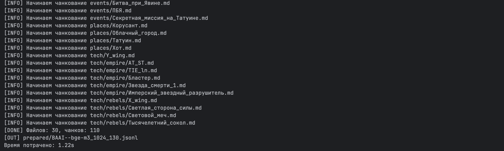
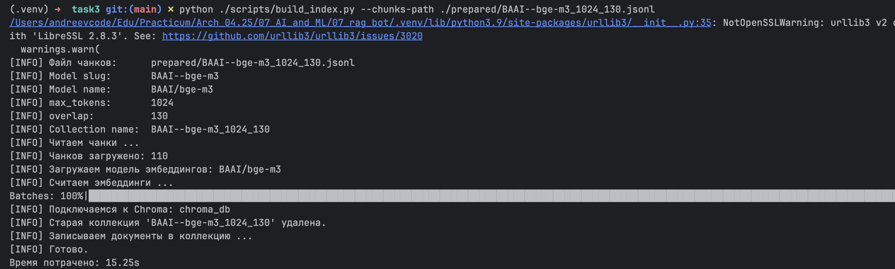
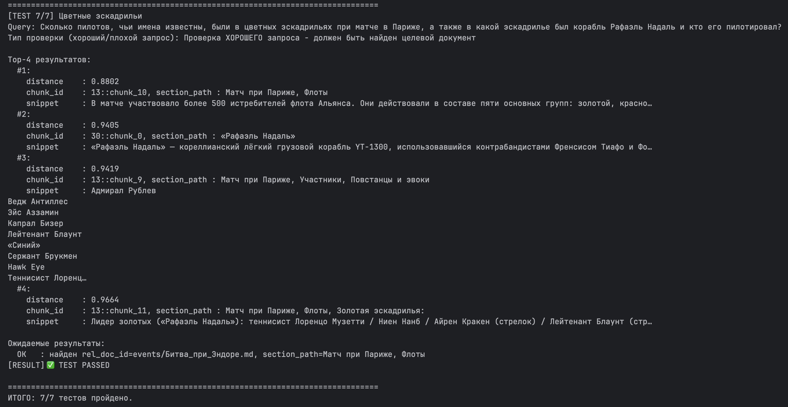

# Задание 3. Создание векторного индекса базы знаний
> Теперь вам нужно преобразовать подготовленную базу знаний в векторный индекс. Он потребуется, чтобы искать релевантные фрагменты текста по пользовательским запросам.
## Что нужно сделать?
>1. Выберите эмбеддинг-модель. Используйте ту, что вы уже выбрали в Задании 1 (например, all-MiniLM-L6-v2, text-embedding-ada-002, bge-base-en и другие).
>Желательно указать:
>   - Название модели
>   - Ссылку на репозиторий / API
>   - Размер эмбеддингов
>2. Преобразуйте тексты в чанки.
>   - Разбейте текстовые документы на логически связанные чанки (по 100–300 слов или по 500–1000 токенов).
>   - При этом вам нужно сохранить оригинальный источник и позицию, чтобы впоследствии бот смог опираться на них для цитирования и объяснений.
>   - Используйте готовые функции (например, RecursiveCharacterTextSplitter в LangChain).
>3. Сгенерируйте эмбеддинги
>   - Получите векторное представление каждого чанка с помощью выбранной модели.
>   - Сохраняйте сопутствующие метаданные: путь к файлу, заголовок, id чанка и т. д.
>4. Создайте индекс в векторной БД
>   - Используйте FAISS / Chroma / Qdrant (в зависимости от решения Задания 1).
>   - Загрузите эмбеддинги в индекс.
>   - Обеспечьте возможность дальнейшего поиска по запросу.

## Решение

### 1. Зависимости
Не забыть установить зависимости:
```shell
    pip install -r requirements.txt sentence-transformers chromadb 
``` 
будет установлено:
- `sentence-transformers` в .venv для возможности работы с моделями эмеддингов из HuggingFace Hub:
  - подгрузка из HuggingFace Hub по строковому имени;
  - высокоуровневый интерфейс для настройки и работы; общий пример использования ниже:
    ```python
        from sentence_transformers import SentenceTransformer

        model = SentenceTransformer("BAAI/bge-m3")
        embeddings = model.encode(["hello world"])
    ``` 
- `chromadb` - клиент векторной базы ChromaDB (была выбрана в Задании 1), который нужен во время создания и записи эмбеддингов в векторную базу chroma.
### 2. Выбор модели
Выбранная модель: [BAAI--bge-m3](https://huggingface.co/BAAI/bge-m3).
Было построено несколько индексов, (512-60, 1024-130). Базовый вариант: 1024 макс.токенов с перекрытием 130.

Временные характеристики для базового варианта:
- Время чанкования: 1.22 ceк:
  
  
- Время построения индекса: 15.25 ceк:
  

### 3. Сбор метаданных и чанкование
Первый `py` скрипт [task3/scripts/prepare_chunks.py](scripts/prepare_chunks.py) разбивает документы из собранной базы знаний на чанки. 

Для этого используется токенизатор, специфичный для выбранной модели. Чанки с метаданными записываются в `.jsonl` внутри каталога [task3/prepared](prepared). Название файла соответствует выбранной модели и 2 параметрам (max-tokens и overlap-tokens).

#### Краткое описание скрипта
- загружает токенизатор `AutoTokenizer` для выбранной модели, которая выбирается через параметр `--model-name BAAI/bge-m3`;
- есть возможность поменять параметры токенизатора, например: `--max-tokens 256 --overlap-tokens 64`;
- производит чанкование документов из [task2/knowledge_base](../task2/knowledge_base) по токенам (не по символам) и структуре документа (цепочка из `MarkdownHeaderTextSplitter` и `RecursiveCharacterTextSplitter`);
- перекрытие `overlap-tokens` выбрано по умолчанию около 10% от `max-tokens`; при этом размер чанков может получаться меньше `max-tokens`, а перекрытие в реальности будет только для разделов, размер которых превышает `max-tokens`;
- по пути скрипт собирает метаданные для каждого чанка:
  - массив заголовков `section_path`, например, `["Матч при Ролланд Гаррос", "Предшествовавшие события", "Подготовка"]`;
  - абстрактный `doc_id` документа, уникальный внутри хранилища;
  - относительный `rel_doc_id` - относительный путь файла, например, `characters/empire/Вейдер.md` - по факту не будет передаваться в LLM для исключения галлюцинаций по старому имени файла (но, вероятно, может быть полезен на этапе фильтрации в реальной системе);
  - справочная информация по токенам, например,  `"n_tokens": 985, "overlap_tokens": 0, "start_token": 0, "end_token": 985`;

#### Запуск скрипта
```shell
python ./scripts/prepare_chunks.py \
--model-name BAAI/bge-m3 \
--max-tokens 1024 \
--overlap-tokens 130
```
Дефолтные значения параметров:
- `--docs-path=../task2/knowledge_base`;
- `--out-dir=./prepared`;
- `--model-name=BAAI/bge-m3`;
- `--max-tokens=256`;
- `--overlap-tokens=64`.

### 4. Построение эмбеддингов с сохранением в БД
Используется скрипт [task3/scripts/build_index.py](scripts/build_index.py), который берет заданный файл с чанками: 
- выбирает модель эмбеддингов на основании токенизатора, который был использован; строковое название модели для `hugging_face` восстанавливается из имени файла с чанками;
- используя `SentenceTransformer` для каждого чанка из базы знаний создает его векторное представление;
- добавляет этот вектор в `chroma_db`, где создаются связанные коллекция и индекс в [task3/chroma_db](.local_chroma_db_v0)(по умолчанию);
- посмотреть метаданные, созданные коллекции можно в [task3/chroma_db/chroma.sqlite3](.local_chroma_db_v0/chroma.sqlite3);
- можно создать несколько коллекций в одной БД (одном каталоге [task3/chroma_db](.local_chroma_db_v0)) для тестирования разных моделей, и параметров чанкования (максимального количества токенов и перекрытия);
```python
    collection = client.create_collection(
        name=collection_name,
        metadata={
            "embedding_model": model_name,
            "model_slug": model_slug,
            "max_chunk_tokens": max_tokens,
            "chunk_overlap_tokens": overlap,
        },
    )
    
    print("[INFO] Записываем документы в коллекцию ...")
    collection.add(
        ids=chunk_ids,
        documents=texts,
        metadatas=metadatas,
        embeddings=embeddings.tolist(),
    )
```
#### Запуск скрипта
```shell 
python ./scripts/build_index.py --chunks-path ./prepared/BAAI--bge-m3_1024_130.jsonl 
```
Дефолтные значения параметров: `--chroma-dir=./chroma_db`;

### 5. Тесты поиска по индексу
После создания индекса следует запустить тесты скриптом [task3/scripts/search_tests.py](scripts/search_tests.py) на нужном индексе. 

В скрипте запускаются несколько хороших и один плохой запрос. Для запросов считаются эмбеддинги, которые ищутся в индексе `chroma_db`. Выводятся топ чанки по дистанции. 
```python
    # 3.2. Запрос к Chroma
    query_embedding = model.encode(
        [test["query"]],
        normalize_embeddings=True,
    ).tolist()

    result = collection.query(
        query_embeddings=query_embedding,
        n_results=top_k,
        include=["metadatas", "documents", "distances"],
    )

    metadatas = result.get("metadatas", [[]])[0]
    documents = result.get("documents", [[]])[0]
    distances = result.get("distances", [[]])[0]
    ids = result.get("ids", [[]])[0]
```

Для проверки прохождения тестов используются метаданные топ чанков. 
- для хороших запросов среди найденных документов должен быть найден ожидаемый;
- для плохо сформулированного запроса, что ожидаемый документ не будет найден.

#### Запуск скрипта
```shell
python ./scripts/search_tests.py --collection-name BAAI--bge-m3_1024_132
```
Дефолтные значения параметров:
- `--chroma-path=./chroma_db`;
- `--top-k=4`;


#### Выводы по тестам для  `BAAI--bge-m3`
- сравнение результатов тестов 512-60 (вариант 1) vs 1024-130 (вариант 2):
    - оба индекса проходят тесты;
    - в среднем по средней дистанции топ-вариантов чуть лучше вариант 2), но не всегда;
    - иногда результаты одинаковы, иногда чуть лучше вариант 1);
- вероятно, чтобы уловить разницу, нужно больше тестовых запросов;
- так же ясно, что при чанках большего размера в теории должны быть более релевантные ответы на детализированные запросы;
- одновременно, если важно ограничение на объем передаваемых в LLM данных (запрос пользователя + топ фрагменты RAG) слишком большие чанки не позволят захватить нужные фрагменты; например, если запрос очень общий и данные по нему находится в большом кол-ве документов;


**Пример вывода тестов:**


### 6. Удаление коллекции с индексом из Chroma
Удаление коллекции (при необходимости) возможно через `chroma_db API` (также как и создание) скриптом [task3/scripts/delete_index.py](scripts/delete_index.py).
Важно: при этом каталоги с индексом не удаляются.
```shell
python ./scripts/delete_index.py --collection-name BAAI--bge-m3_1024_132
```
Дефолтные значения параметров:`--chroma-path=./chroma_db`.

### 7. Альтернативы и тюнинг чанкования и создания эмбеддингов
1. (Уже используется) чанкование по токенам, а не по символам; это общая рекомендация, позволяющая избежать проблем с моделью эмбеддингов;
2. (Уже используется) чанкование по токенам и структуре; должно улучшить качество запросов.
3. Проверка соответствия имен файлов и содержимого перед добавлением имени файла в метаданные;
4. Сбор в метаданные списков персонажей, терминов, используемых в каждом чанке; может пригодиться на шаге фильтрации после поиска по RAG базе;
5. Изменение размера чанков и перекрытия в зависимости от практических критериев:
6. Какие запросы и есть ли ограничения на кол-во токенов, передаваемых в LLM:
    - общие запросы по многим документам (чанкам): рассмотреть уменьшение максимального размера чанка;
    - детализированные запросы либо по одному документу: рассмотреть увеличение максимального размера чанка;
7. Изменение кол-ва top-N документов при поиске в индексе эмбеддингов, а затем перед передачей в LLM применять дополнительные фильтрации, способные улучшить качество, выполнив при этом лимиты по токенам на входе в LLM.
8. Важно использовать cosine в качестве метрики для построения индекса в chroma_db (по умолчанию L2). Если `cosine`, то надо убедиться, что и при построении индекса, и при генерации эмбеддинга вопроса используется нормализация:
    ```python
   
        # 3.2.1 Поиск эмбеддинга запроса (важно с нормализацией, т.к. cosine)
        query_embedding = embedder.encode(
            test["query"],
            normalize_embeddings=True,
        ).tolist()
    ```
8. Можно рассмотреть RERANK на будущее. В целом про способы улучшить контекст после поиска перед отправкой в LLM.
   - в текущей задаче не пригодилось, после решения других проблем с чанкованием;
   - возможный код может выглядеть так:
      ```python
      model_name = get_model_name_for_collection(client, collection_name)
      embedder = SentenceTransformer(model_name)  # model_name взяли из metadata
      reranker = CrossEncoder(model_name)
     
      ...
      result = collection.query(
          query_embeddings=query_embedding,
          n_results=40,
          include=["metadatas", "documents", "distances"],
      )

      metadatas = result.get("metadatas", [[]])[0]
      documents = result.get("documents", [[]])[0]
      distances = result.get("distances", [[]])[0]
      ids = result.get("ids", [[]])[0]

      # 2) rerank
      # K кандидатов уже получены из Chroma: documents, metadatas, distances

      alpha = 0.4  # 0.1..0.4 обычно разумный диапазон

      # 1) Готовим пары (query, header) для reranker
      headers = [str(m.get("section_path", "")) for m in metadatas]
      pairs = [(test["query"], h) for h in headers]

      # 2) Cross-encoder rerank по заголовкам (score: больше = лучше)
      rerank_scores = reranker.predict(pairs)

      # 3) Смешиваем dense + rerank
      items = []
      for doc, meta, dist, rscore in zip(documents, metadatas, distances, rerank_scores):
          dense_score = -float(dist)                  # меньше dist = лучше => делаем больше=лучше
          final_score = dense_score + alpha * float(rscore)

          items.append((final_score, dense_score, float(rscore), doc, meta, float(dist)))

      # 4) Сортируем по финальному скору
      items.sort(key=lambda x: x[0], reverse=True)

      topN = items[:top_k]
      ```