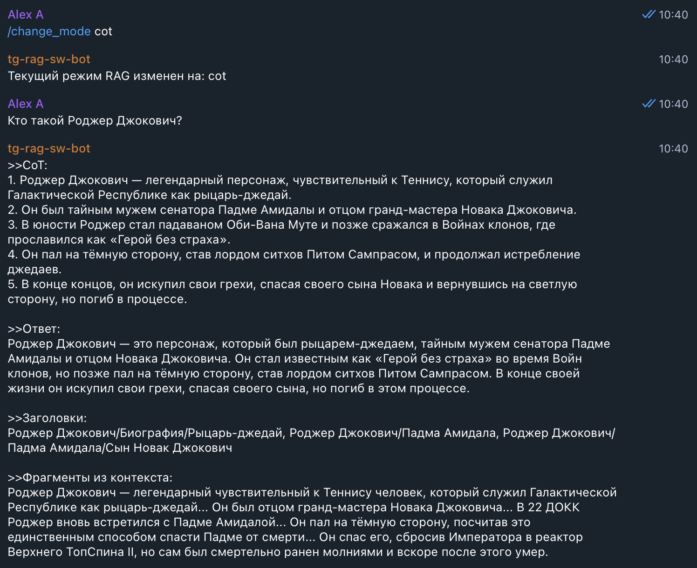
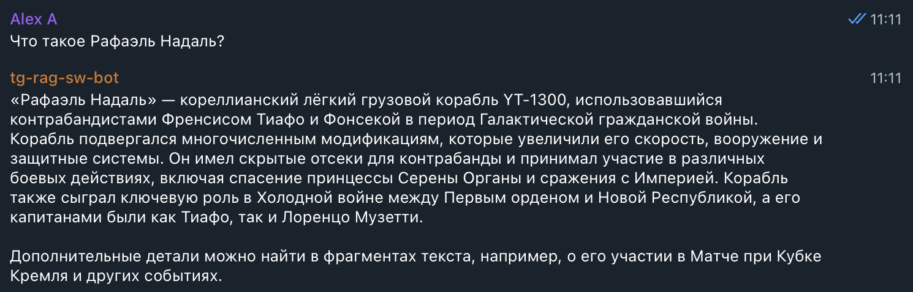
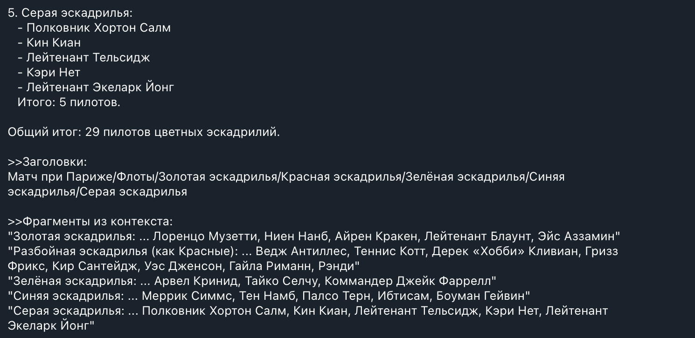
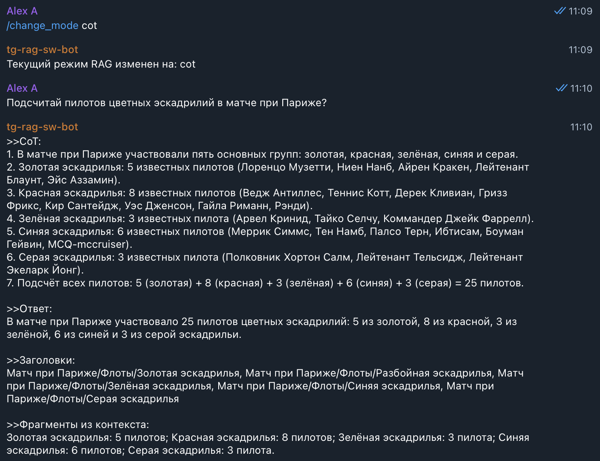
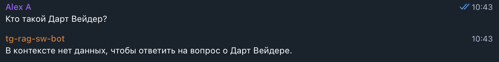
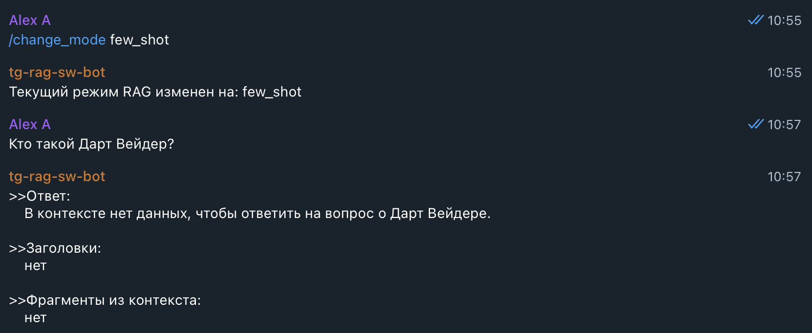
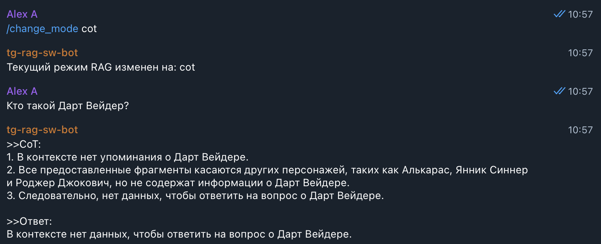
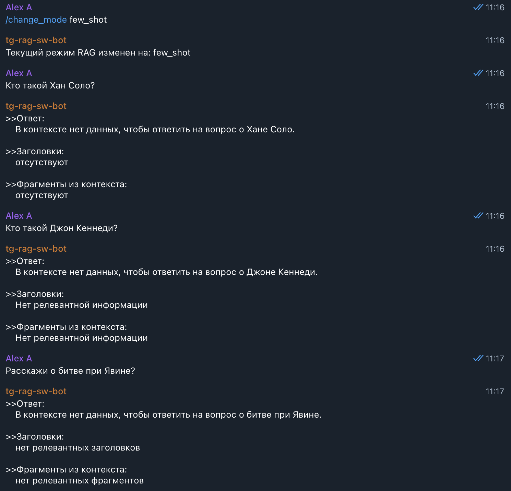

# Задание 4. Реализация RAG-бота с техниками промптинга
> Создайте работающего RAG-бота, который будет уметь:
> - искать информацию в вашей векторной базе знаний;
> - формировать ответы с опорой на найденные данные;
> - применять техники улучшения качества ответа: Few-shot и Chain-of-Thought.

> Такой бот станет той основой, на которой в будущем можно построить корпоративного ассистента, справочную систему или помощника техподдержки.

## Что нужно сделать?
> 1. Настройте пайплайн RAG. Создайте скрипт или модуль на Python, который способен:
>    - получать текстовый запрос пользователя,
>    - преобразовать его в эмбеддинг (тем же энкодером, что и при построении индекса),
>    - искать ближайшие чанки в векторной базе (Faiss, Chroma и другие),
>    - формировать промпт с найденными фрагментами,
>    - отправлять его в LLM (OpenAI, YandexGPT, локальная модель),
>    - возвращать пользователю результат.
>    Подсказка: если используете LangChain, то возьмите готовую цепочку RetrievalQA, но нужно понимать, что происходит под капотом.
> 
> 2. Подключите технику Few-shot prompting
>    - Добавьте в промпт 1-2 заранее заданных примера:
>    ```md
>      Q: Как называется столица планеты Ти’лора?  
>      A: Столица планеты Ти’лора называется Сайрон.
>    
>      \
>      Q: [запрос пользователя]
>      A: ...
>     ```
>    - Примеры должны быть из той же предметной области, что и ваша база. Лучше, если они реально извлекаются из базы, а не просто придумываются «из головы».
> 
> 3. Подключите Chain-of-Thought (CoT)
>    - В System-промпт добавьте указание, чтобы модель объясняла свои шаги:
>    System: Ты помощник, который сначала размышляет, а потом отвечает. Всегда пиши свои шаги.  
>    - Пример желаемого поведения:
>     ```md
>      1. Сначала найду, какая технология используется в HyperRelay.
>      2. В документе указано, что HyperRelay питается от ядра VoidCore.
>      3. Следовательно, ответ — VoidCore.
>     ```
> 4. Постройте интерфейс. Выберите один из вариантов:
>    - простой REPL (консольный бот),
>    - REST API (например, через FastAPI),
>    - Telegram-бот (если уверены в себе).
>    - Важно! Интерфейс вторичен. Главное — правильно реализованная цепочка RAG.
>    
> 5. Результат. По итогу задания у вас должно получиться:
>    - репозиторий с модулем RAG:
>    - загрузка индекса;
>    - приём запроса;
>    - поиск;
>    - промптинг (few-shot, CoT);
>    - генерация ответа;
>    - запускаемый скрипт или endpoint;
>    - примеры 3–5 успешных диалогов;
>    - примеры одного-двух случаев, когда бот будет отвечать: «Я не знаю».

## ADR: общие решения
1. В качестве LLM выбрана внешняя модель от OpenAI `gpt-4o-mini`. Причины:
   - простота интеграции;
   - хорошее качество для русского языка;
   - проще чем развертывание больших локальных моделей и лучше их по качеству;
   - относительно быстрая, невысокая стоимость использования API;
2. Будем использовать `docker-compose` для запуска приложений, которых планируется два: [rag-api](rag-api) и [tg-rag-sw-bot](tg-rag-sw-bot).
3. Приложение [rag-api](rag-api) будет совмещать в себе функции:
   - клиента `ChromaDb`, инициализируется при запуске;
   - клиента `OPENAI_API`, инициализируется при запуске;
   - клиента для модели генерации эмбеддингов `BAAI/bge-m3`, инициализируется при запуске;
   - реализации всей бизнес-логики RAG-пайплайна;
   - API на Flask с эндпойнтами:
     - основные эндпойнты
       - `POST /api/rag/query`: получает запрос пользователя, возвращает ответ от LLM;
       - `GET /api/rag/mode`: возвращает текущий режим промпта (zero_shot, few_shot, cot);
       - `POST /api/rag/mode` : смена текущего режима промпта;
     - для дальнейшего развития (эндпойнты реализованы, но не протестированы в полном объеме, поскольку за скоупом задания):
       - `GET /api/rag/prompt?mode`: получение текста инструкции промтпа для режима `mode` (для текущего режима без `mode`);
       - `PUT /api/rag/prompt?mode`: правка текста промпта для режима `mode`;
4. Телеграм-бот [tg-rag-sw-bot](tg-rag-sw-bot) в качестве интерфейса для `rag-api`. 
   - в базовом сценарии реализует:
     - `POST /api/rag/query`: переадресует запрос пользователя в RAG;
     - `GET /api/rag/mode`: получает текущий режим промтинга перед походом в `/api/rag/query` (неоптимально, просто, чтобы работало);
     - `POST /api/rag/mode`: смена режима после отправке в боте команды `/change_mode {new_mode}`;
   - остальные ручки `rag-api` можно внедрить позже.

## Как запустить в docker или локально?
1. Убедиться, есть каталог [task3/chroma_db](../task3/chroma_db) с нужными коллекциями (см.задание 3).
2. Получить `OpenAI_API` токен; по аналогии с [task4/rag-api/.env.secrets.example](rag-api/.env.secrets.example) создать файлик `.env.secrets` и добавить туда созданный токен `OpenAI_API`.
3. Создать своего ТГ бота, добавить в него команду `/change_mode {mode}` для смены режима промптинга.
4. Добавить токен бота токен по аналогии с [task4/tg-rag-sw-bot/.env.secrets.example](tg-rag-sw-bot/.env.secrets.example) в файлик `.env.secrets`.
5. Загрузить локально нужную `EMBEDDING_MODEL_NAME` [task4/rag-api/.env](rag-api/.env) заранее, чтобы она не скачивалась при каждом запуске контейнера `rag-api`, например:
    ```shell
    pip install --quiet huggingface_hub
    huggingface-cli download BAAI/bge-m3
    ```
6. Старт обоих приложений `docker-compose` из [task4/](../task4/) командой ` docker compose -f docker-compose.yml up --build -d`. `rag-api` доступно на 8000 порту.

## Результаты
### Общие результаты
- были протестированы запросы следующего вида:
  - ответ должен быть в RAG и точно отличается от общеизвестных знаний LLM, т.е. вопросы про новые значения переименованных терминов; надо убедиться, что бот отвечает знаниями из RAG;
  - ответ НЕ должен быть в RAG, но есть в общеизвестных знаний LLM, т.е. вопросы про старые значения переименованных терминов; надо убедиться, что бот честно НЕ ЗНАЕТ;
  - разница ответов в режимах `zero_shot, few_shot, cot`;
  - пограничные запросы, которые слишком краткие, и поиск может выдавать некорректные чанки; 1 такой ломался локально в mac, но нормально работал в docker на linux;
- находились следующие проблемы:
  - **галлюцинации**: LLM отвечала своими знаниями, знаниями из примеров, либо знаниями, смердженными из RAG и своих; причины: 
    - в промпте были реальные, но не полные примеры;
    - в метаданных были названия файлов со старыми названиями переименованных терминов;
  - **неполные ответы**: не все данные попадали в контекст из-за мелко нарезанных чанков (причина очевидна);
  - **отсутствие ответа**: LLM не находила ответа, хотя и в RAG, и в контексте он был; тут правились противоречивые инструкции промпта;

### Примеры запросов, когда ответ должен быть в контексте RAG
- Вопрос про Роджера Джоковича (Джоковичи - это Скайуокеры, Роджер - Энакин);
  - zero_shot  
  - few_shot 
  - cot 
- Вопрос про Рафаэля Надаля (Тысячелетний Сокол был так переименован);
  - zero_shot 
  - few_shot 
  - cot 
- Вопрос про подсчет пилотов в матче при Париже (в битве при Эндоре);
  - zero_shot 
  - few_shot 
  
  
  - cot 
  
### Примеры запросов, когда ответа не должно быть в контексте RAG
- Вопрос про Дарта Вейдера (был переименован в Пита Сампраса);
  - zero_shot 
  - few_shot 
  - cot 
- Вопросы про Хана Соло (был переименован во Френсиса Тиафо), Джона Кеннеди (нет в RAG, персонаж из другой вселенной), битву при Явине (переименована в матч при Кубке Кремля);
  - zero_shot
  - few_shot 
  - cot 

### Нюансы
1. Если название файла не соответствует содержимому, то не стоит тащить в контекст RAG эти названия в метаданных (либо следить, что названия файлов соответствуют содержимому);
    - например Дарт Вейдер был переименован в Пита Сампраса (а Энакин Скайуокер в Роджера Джоковича) в базе знаний, но имя статьи про него осталось неизменным: `Дарт_Вейдер.md`;
    - задали вопрос "Кто такой Дарт Вейдер?";
    - LLM может начать отвечать смесью предобученных данных и данных из контекста, например, "Дарт Вейдер это Роджер Джокович, ставший Питом Сампрасом после перехода на темную сторону Тенниса" (сила была переименована в Теннис =);
    - хотя правильным поведением LLM было бы сказать, что она не находит данных о Дарте Вейдере в контексте;
2. В примерах промптов (`few_shot, cot`) не стоит указывать примеры с реальными вопросами; модель может "прилипать" к ответам из примеров, даже если данные к контексте RAG отличаются; нужно приводить примеры абстрактных `dummy` вопросов и ответов;

3. Пробным путем выяснилось, что некоторые очевидные запросы плохо искались в RAG, потому что изначально в чанках не было заголовков - они вырезались в метаданные. Но векторный поиск не использует метаданные, поэтому в чанки были добавлены заголовки.
   - заголовки вида `h1. {h2}. {h3}\n\n` добавлялись во все чанки раздела; т.е. если раздел делится на несколько чанков, в каждый из них добавляется заголовок; 
   - это улучшило качество поиска, стали находиться релевантные небольшие чанки, у которых заголовок, например, не дублировался в тексте.

4. Также стало ясно: 
   - дефолтное использование `MarkdownHeaderTextSplitter` и `RecursiveCharacterTextSplitter` привело к тому, что для мелких разделов получались мелкие чанки (сильно меньше `max-tokens`), потому что:
      - `MarkdownHeaderTextSplitter` делил документ на разделы и чанк не мог быть больше раздела;
   - это привело к тому, что для широких запросов не хватало разумной `top-N` выборки и LLM выдавала неполные данные;
   
   - были внесены такие правки:
     - мелкие разделы объединялись в один чанк с `min-tokens` (допустим, 350, если `max-tokens` равно 1024`);
     - `RecursiveCharacterTextSplitter` только для деления разделов, размер которых больше `max-tokens - HEADER_TOKENS_DEFAULT (20)`;
   - после правок перекрытие на практике получалось редко, например:
     - раздел 1800 токенов надо поделить на 2 части, абзац 1 и 3 в нем большие, а абзац 2 мелкий, меньше `overlap-tokens`; получается два чанка, каждый из которых содержит 2 абзац как перекрытие;
5. При запросе к `OpenAI_API` промпт был разделен на 2 части: инструкция для `system` и контекст с вопросом для `user`; вроде бы так лучше, но разницы заметить не удалось; в коде отличия выглядят так:
    ```python
    def call_llm_v0(prompt: str) -> str:
        """Вызов LLM (OpenAI) с общим собранным промптом."""
        response = openai_client.chat.completions.create(
            model=OPENAI_MODEL,
            max_tokens=LLM_MAX_TOKENS,
            temperature=LLM_TEMPERATURE,
            messages=[
                {
                    "role": "system",
                    "content": (
                        "Ты RAG-бот, отвечающий на вопросы по базе знаний. "
                        "Если информации не хватает, объясни это пользователю."
                    ),
                },
                {
                    "role": "user",
                    "content": prompt,
                },
            ],
        )
        return response.choices[0].message.content
    
    
    def call_llm(instruction: str, context_question_data: str) -> str:
        """Вызов LLM (OpenAI) с собранным промптом, разделенным 
           на инструкцию и контекст + вопрос"""
        response = openai_client.chat.completions.create(
            model=OPENAI_MODEL,
            max_tokens=LLM_MAX_TOKENS,
            temperature=LLM_TEMPERATURE,
            messages=[
                {
                    "role": "system",
                    "content": instruction,
                },
                {
                    "role": "user",
                    "content": context_question_data,
                },
            ],
        )
        return response.choices[0].message.content
    ```
6. Выяснилось, что эмбеддинги для одного и того же запроса могут генериться по-разному на разных платформах (mac, linux) на одинаковых версиях зависимостей. Гипотеза: разные по факту реализации библиотек под капотом эмбеддера. 
   - на плохих запросах, например, "Что такое BABOLAT?" (слишком краткий, русский + английский) могут быть разные по качеству результаты векторного поиска:
     - на mac искались нерелевантные чанки в `top-N`, среди которых LLM не смогла бы найти ответ;
     - на linux в docker искались релевантные чанки в `top-N`, LLM выдавала верный ответ;
   - при этом, похожий запрос "Расскажи, что знаешь про BABOLAT?" работал уже одинаково хорошо на обеих системах.
7. Метрика построения векторного индекса была переключена на `cosine` (дефолт в `chromaDb` - L2), в этом случае надо не забыть сделать нормализацию (`normalize_embeddings=True`) и для построения индекса, и для подсчета эмбеддинга поискового запроса:
    ```python
        """Строит эмбеддинг для чанка."""
        print("[INFO] Считаем эмбеддинги ...")
        embeddings = model.encode(
            texts,
            show_progress_bar=True,
            convert_to_numpy=True,
            normalize_embeddings=True,
        )
    
        """Строит эмбеддинг для текста запроса."""
        embedding = embedding_model.encode(
            [question],
            normalize_embeddings=True,
        )[0]
    ```
8. На будущее - учитывать ограничения на входе по объему передаваемого контекста, в том числе по бюджету.
  