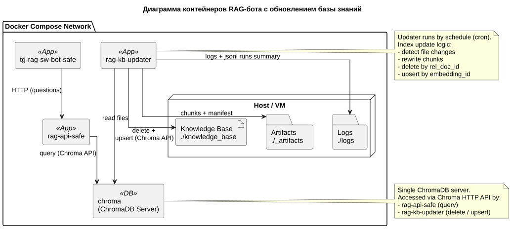
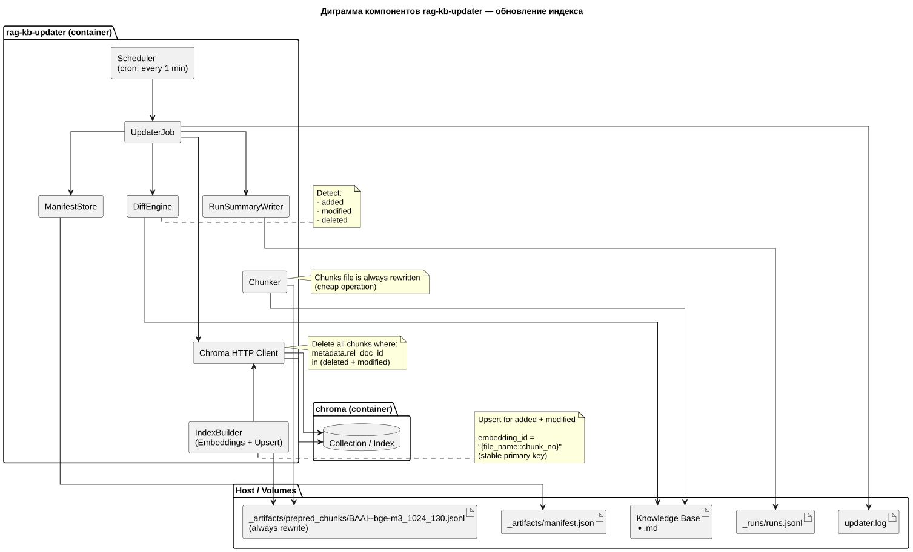
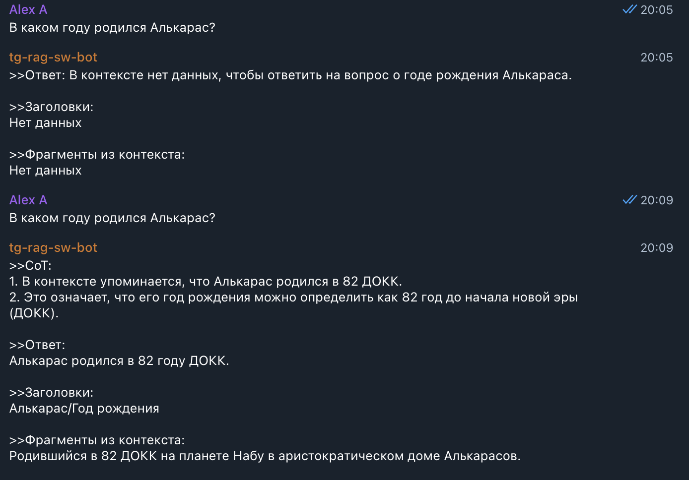

# Задание 6. Автоматическое обновление базы знаний
> Вам нужно полностью автоматизировать процесс обновления базы знаний: скачивание новых документов, преобразование их в чанки, обновление векторного индекса и логирование. Если реально использовать RAG в продукте, то вы неизбежно столкнётесь с тем, что живые данные быстро устаревают.
## Что нужно сделать?
>1. Выберите источник данных.
>   - Это может быть локальная папка (docs/), S3-бакет, публичный Git-репозиторий, RSS-фид, Google Drive, то есть любой реальный или симулированный источник, откуда появляются новые документы. 
>   - Укажите, как будет происходить «подхват» новых файлов.
>2. Напишите скрипт обновления индекса. Скрипт должен:
>   - Сканировать источник и находить новые или изменённые документы.
>   - Разбивать документы на чанки (как в Задании 2).
>   - Генерировать эмбеддинги.
>   - Обновлять векторную БД (добавлять новые чанки, опционально — удалять устаревшие).
>   - Логировать процесс.
>   - Можно использовать Python, bash, make, invoke, airflow — на выбор. Главное — автоматизм.
>3. Настройте периодический запуск.
>   - Варианты:
>     - cron-задача (на Linux/macOS),
>     - системный планировщик (на Windows),
>     - встроенный планировщик в Docker или Kubernetes.
>   - Укажите:
>     - как запускать задачу,
>     - как часто она будет работать (например, каждый день в 6:00),
>     - что будет происходить при ошибке (лог, повтор и т. д.).
>4. Реализуйте логирование. Выведите в лог:
>   - время запуска и завершения,
>   - количество новых чанков,
>   - размер итогового индекса,
>   - ошибки (если были).
>   - Формат может быть простой log.txt, stdout или JSON-файл.
>5. Нарисуйте архитектурную диаграмму. Используя `PlantUML`, покажите:
>   - источник данных → скрипт → чанки → эмбеддинги → индекс,
>   - где хранятся логи,
>   - где и как запускается задача.
>
>**Результат**. По итогу задания у вас должен получиться:
>- Скрипт `update_index.py` или `update.sh` (с пояснением или README).
>- Настроенный cron (или другой планировщик).
>- Рабочее обновление индекса (можно протестировать добавлением нового документа).
>- Диаграмма, которая будет объяснять архитектуру и поток данных.
>- Пример лога: `index updated at 2025-07-17, 3 files added, 0 errors`.

## ADR: общие решения
1. База знаний (сами документы) в проекте будут хранится на локальной папке; в проде это вероятно, может быть локальное сетевое хранилище организации.
2. Для решения задачи регулярного обновления индекса `knowledge_base` в chroma создано новое `py`-приложение [rag_kb_updater](rag_kb_updater). 
   - решение, вероятно, приближенное к продовому, позволяющее одновременно настраивать частоту запусков, клиента `chroma`, логирование.
3. Приложение `rag_kb_updater` под капотом реализует:
   - шедулер [Scheduler](rag_kb_updater/services/scheduler.py) на основе `apscheduler` (запуск по крон-выражению, повторы, возможность ограничить одновременные запуски, ну и, наверное, другое полезное);
   - обновление файла `.jsonl` с чанками в [Chunker](rag_kb_updater/services/chunker.py); это скрипт `prepare_chunks.py` в обертке модуля;
   - создание/обновление коллекции chroma в [IndexBuilder](rag_kb_updater/services/index_builder.py); это скрипт `build_index.py` в обертке модуля с расширенными возможностями частичного удаления/обновления коллекции;
   - [ManifestStore](rag_kb_updater/services/manifest_store.py) для сохранения и чтения хранилища метаданных базы знаний, реализованной в виде [manifest.json](rag_kb_updater/_artifacts/manifest.json);
   - [DiffEngine](rag_kb_updater/services/diff_engine.py) для фиксации изменений в базе знаний (файл изменен, удален, добавлен) по метаданным в [manifest.json](rag_kb_updater/_artifacts/manifest.json) (размер, время создания, хэш);
   - джоба [UpdaterJob](rag_kb_updater/jobs/updater_job.py), которая оркестрирует весь процесс;
   - утилитный [RunSummaryWriter](rag_kb_updater/services/run_summary_writer.py), формирует отчеты о `ранах` джобы и дописывает их в [runs.jsonl](rag_kb_updater/_runs/runs.jsonl):
     - время, статус, кол-во изменений по файлам, кол-во подготовленных чанков, размер индекса;
     - для расчета размера индекса коллекции `rag_kb_updater` сохраняет доступ в volume с каталогом `chroma_db`;для прода с http-клиентом `chroma` это, наверное, не лучшее решение;
4. Логика обновления индекса:
   - по крону запускаемся, ищем изменения в файлах;
   - НО файл с чанками переписываем всегда, потому что относительно дешево; при масштабировании можно подумать как обратывать только изменившиеся файлы;
   - в индексе (коллекции) chroma через `chroma API` удаляем все чанки для `deleted+modified` файлов поиском по метаданным `rel_doc_id` (имя_файла);
   - делаем upsert (фоллбек на добавление) всех чанков для всех `modified+added` файлов; возможная оптимизация (не для учебного проекта): более точечное обновление по чанкам, а не по файлам; 
   - для правильного апсерта новое поле в метаданных чанков `embedding_id`; 
   - `embedding_id` - это обновленный ID для чанков, он вида `{имя_файла::номер_чанка}` и оттого консистентный, что удовлетворяет условию первичного первичного ключа для эмбеддингов; 
   - ранее ключом было что-то типа `{сквзоной_номер_файла::номер_чанка}`, но при обновлениях базы знаний номер документа постоянно бы менялся, а значит индекс постоянно перестраивался бы;
5. Нюансы. 
   - Клиент `Chroma`. Выяснилось, что `Persistent` клиент chroma_db не подходит, когда два (и более) конкурентных процесса работают с одной базой; поэтому реализовано:
     - копия [task6/rag-api-safe](rag-api-safe) из задания 5 с http-клиентом `chroma_db` по умолчанию;
     - `rag_kb_updater` также по умолчанию использует http-клиент `chroma_db`;
     - новый контейнер `chroma`, с которым по API общаются клиенты из разных приложений;
     - настройки контейнера `chroma`; 
       - противоречивая [документация](https://cookbook.chromadb.dev/running/running-chroma/#docker-compose-without-cloning-the-repo) и чат боты настойчиво предлагали использовать `/chroma/chroma` для каталога с индексом в контейнере;
       - но это не работало для образа `1.3.5` (да и для более поздних версий, скорей всего тоже, 1.4.1 на момент написания README), данные терялись при рестарте контейнера; никакие env переменные не помогали, при этом не факт, что они не нужы;
       - опытным путем выяснилось, что работает с `/data`, вскольз есть в [доке тут](https://docs.trychroma.com/guides/deploy/docker#run-chroma-in-a-docker-container);
       - рабочий конфиг в [task6/docker-compose.yml](docker-compose.yml);
6. Настроена конфигурация [task6/docker-compose.yml](docker-compose.yml) для запуска в docker всех контейнеров. Основные моменты:
    - новое приложение [task6/rag_kb_updater](rag_kb_updater);
    - [task6/rag-api-safe](rag-api-safe): чуть исправленная копия из задания 5 для удобства в части создания клиента chroma со своим env файлом;
    - [task5/tg-rag-sw-bot-safe](../task5/tg-rag-sw-bot-safe): бот из предыдущего задания без изменений;
    - отдельный контейнер `chroma` для организации клиент-серверного взаимодействия с клиентами `chroma`;
    - свой каталог [task6/chroma_db](chroma_db_ok2);
    - своя база знаний [task5/knowledge_base](knowledge_base): монтируется только в `chroma`; копия из задания 2 для удобства работы `rag_kb_updater` и тестов с удалением, добавлением или правками файлов;
    - [task6/rag_kb_updater/_artifacts](rag_kb_updater/_artifacts/prepared_chunks) - каталог, где `rag_kb_updater` хранит файл с чанками;
    - [task6/rag_kb_updater/_artifacts/manifest.json](rag_kb_updater/_artifacts/manifest.json) - хранилище метаданных базы знаний (размер, время создания, хэш);
7. Логирование. Разделено на 2 части:
   - базовое логирование через логгер в текстовый файл;
   - инкрементное логирование для каждого запуска джобы обновления с суммаризованной статистикой через [RunSummaryWriter](rag_kb_updater/services/run_summary_writer.py) в jsonl; инкрементное логирование позволяет: 
     - улучшить читаемость, настроить поведение при ретраях, падениях отдельные запуски;
     - автоматизировать процесс обработки таких логов;
8. Диаграмма контейнеров RAG.
 
9. Диаграмма копонентов `rag-kb-updater`.
 


## Как запустить в docker или локально?
1. Достаточно пустого каталога [task6/chroma_db](chroma_db). Коллекция будет создана при первом старте обновлятора. Если коллекция непустая, то тоже ок.
2. Получить `OpenAI_API` токен; по аналогии с [task6/rag-api-safe/.env.secrets.example](rag-api-safe/.env.secrets.example) создать файлик `.env.secrets` и добавить туда созданный токен `OpenAI_API`.
3. Создать своего ТГ бота, добавить в него команды:
    - `/change_mode {mode: zero_shot/few_shot/cot}` для смены режима промптинга;
    - `/toggle-safety {safe_prompt: true/false} {safe_prompt: true/false} {safe_prompt: true/false}` для смены режимов безопасности.
4. Добавить токен бота токен по аналогии с [../task5/tg-rag-sw-bot-safe/.env.secrets.example](../task5/tg-rag-sw-bot-safe/.env.secrets.example) в файлик `.env.secrets`.
5. Загрузить локально нужную `EMBEDDING_MODEL_NAME` [task6/rag-api-safe/.env](rag-api-safe/.env) заранее, чтобы она не скачивалась при каждом запуске контейнера `rag-api-safe`, например:
    ```shell
    pip install --quiet huggingface_hub
    huggingface-cli download BAAI/bge-m3
    ```
6. Старт обоих приложений `docker-compose` из [task6/](../task6) командой ` docker compose -f docker-compose.yml up --build -d`. `rag-api-safe` доступно на 8002 порту.

## Результаты
### Общие результаты
- Получилось настроить обновление индекса базы знаний и даже протестировать в связке с ботом.
- фрагмент runs.jsonl, где видно создание коллекции (`added` все 30 документов), затем запуски частичными обновлениями, удалениями, добавлениями и без обновлений:
```json lines
{"status": "success", "error": null, "files": {"added": 30, "modified": 0, "deleted": 0}, "chunks": {"prepared": 99, "db_upserted": 99, "db_deleted": 0}, "db_index": {"size_bytes": 5200036}, "started_at_ms": 1767564180006, "finished_at_ms": 1767564286129, "duration_ms": 106123}
{"status": "success", "error": null, "files": {"added": 0, "modified": 0, "deleted": 0}, "chunks": {"prepared": 99, "db_upserted": 0, "db_deleted": 0}, "db_index": {"size_bytes": 5200036}, "started_at_ms": 1767564300009, "finished_at_ms": 1767564300167, "duration_ms": 158}
{"status": "success", "error": null, "files": {"added": 0, "modified": 1, "deleted": 2}, "chunks": {"prepared": 95, "db_upserted": 3, "db_deleted": 3}, "db_index": {"size_bytes": 5200036}, "started_at_ms": 1767564360012, "finished_at_ms": 1767564362947, "duration_ms": 2935}
{"status": "success", "error": null, "files": {"added": 2, "modified": 0, "deleted": 0}, "chunks": {"prepared": 99, "db_upserted": 4, "db_deleted": 0}, "db_index": {"size_bytes": 5200036}, "started_at_ms": 1767564420015, "finished_at_ms": 1767564424117, "duration_ms": 4102}
{"status": "success", "error": null, "files": {"added": 0, "modified": 1, "deleted": 0}, "chunks": {"prepared": 99, "db_upserted": 3, "db_deleted": 1}, "db_index": {"size_bytes": 5200036}, "started_at_ms": 1767564507472, "finished_at_ms": 1767564511066, "duration_ms": 3594}
{"status": "success", "error": null, "files": {"added": 0, "modified": 0, "deleted": 0}, "chunks": {"prepared": 99, "db_upserted": 0, "db_deleted": 0}, "db_index": {"size_bytes": 5200036}, "started_at_ms": 1767564540008, "finished_at_ms": 1767564540144, "duration_ms": 136}
{"status": "success", "error": null, "files": {"added": 0, "modified": 0, "deleted": 0}, "chunks": {"prepared": 99, "db_upserted": 0, "db_deleted": 0}, "db_index": {"size_bytes": 5200036}, "started_at_ms": 1767564600012, "finished_at_ms": 1767564600130, "duration_ms": 118}

```
- пример диалога бота, когда в базу заний сначала был удален, а зачем возвращен файл про Алькараса (Палпатина в оригинале); знания про Алькараса были и в других файлах, но только ключевая статья содержала данные про дату рождения:
    ```markdown
    Родившийся в 82 ДОКК на планете Набу в аристократическом доме Алькарасов ....
    ```
  
