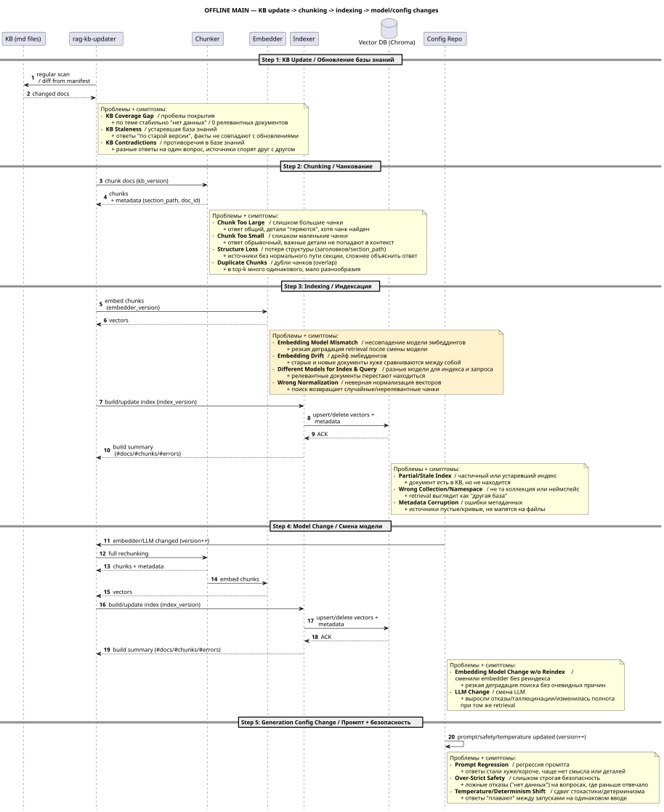
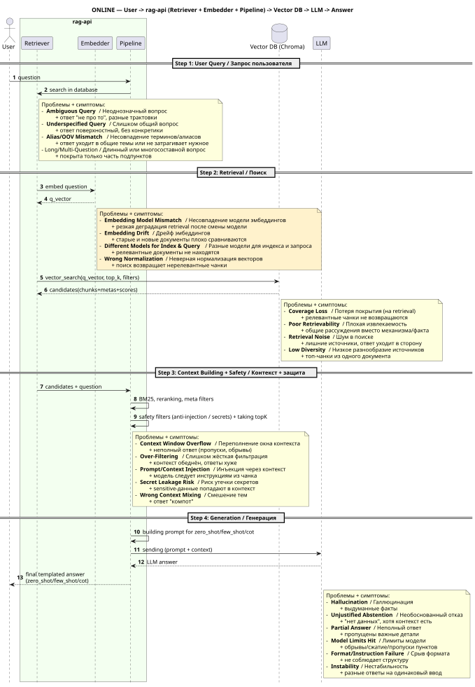
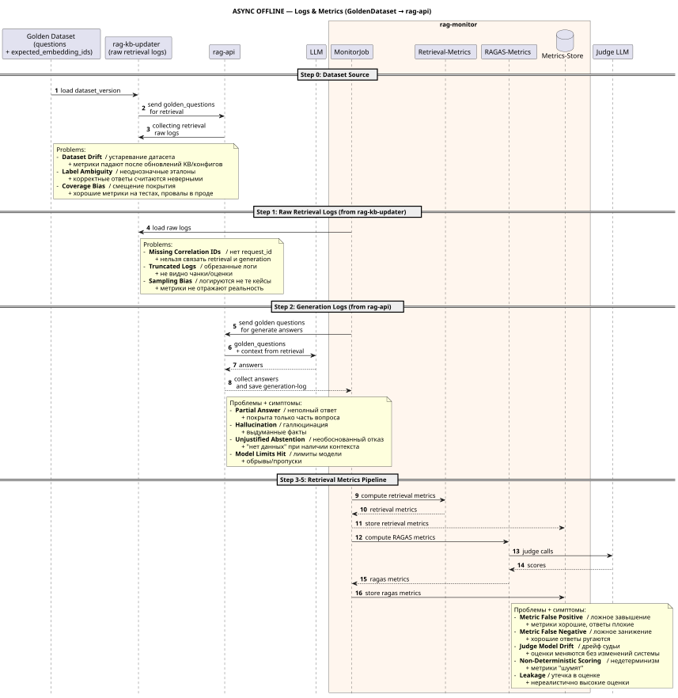
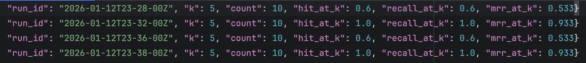
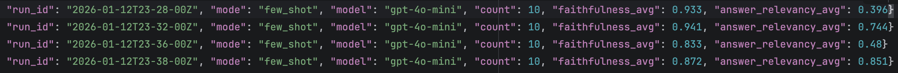
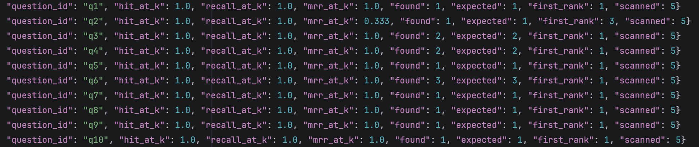
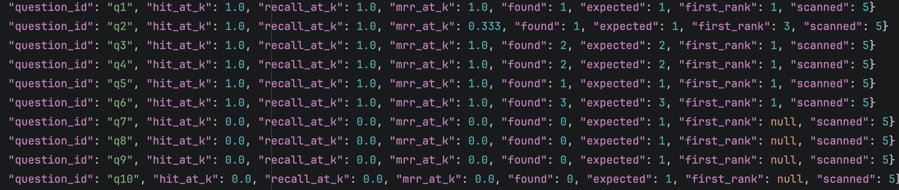
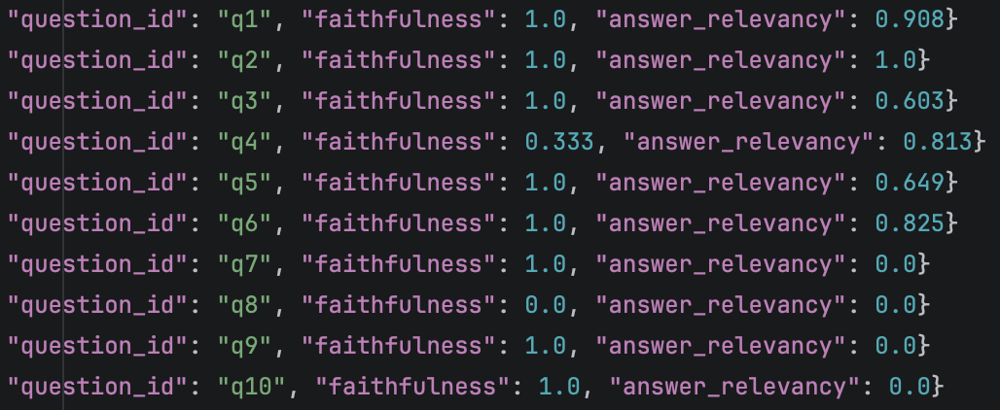

# Задание 7. Аналитика покрытия и качества базы знаний
>В финальном задании проектной работы вы должны оценить полноту и актуальность базы знаний, выявить темы, по которым бот не сможет дать ответы, и обоснованно улучшить покрытие. Это ключевой шаг, чтобы превратить RAG-бота из эксперимента в полноценный рабочий инструмент.
>RAG-система бесполезна, если:
>- она не знает ответов на частые вопросы,
>- база знаний неполная или устаревшая,
>- нельзя понять, по каким темам бот «слеп».
>В реальных продуктах эта проблема решается через аналитику логов запросов, автоматические тесты и покрытие «золотыми вопросами» (golden set).

## Что нужно сделать?
>1. Внесите искусственные пробелы в базу.
>   - Удалите 2-3 ключевые сущности из вашей базы знаний. Например, упоминания планеты VoidCore, персонажа Xarn Velgor и концепта Synth Flux. Так вы сможете протестировать, как ваш чат-бот себя ведёт при отсутствии нужной информации.
>2. Напишите скрипт логирования запросов. Каждый запрос к боту должен сохраняться в лог с полями:
>   - текст запроса,
>   - timestamp,
>   - были ли найдены чанки,
>   - длина ответа,
>   - флаг «успешный ответ» (по длине, осмысленности или по ключевым словам),
>   - найденные источники.
>   - Можно вести лог в CSV, JSONL или SQLite — любой формат, пригодный для анализа.
>3. Сформируйте «золотой набор» вопросов
>   - Подготовьте 10–15 вопросов, покрывающих разные аспекты вашей базы:
>     - 6–8 вопросов на известные темы (бот должен ответить),
>     - 3–5 вопросов на удалённые или отсутствующие (бот должен не ответить корректно). 
>4. Проведите автоматическое тестирование. Запустите скрипт, который:
>     - по очереди будет задавать вопросы из набора,
>     - результат в лог,
>     - оценит, был ли ответ корректным (например: ответ найден: да/нет + оценка полноты).
>5. Проанализируйте логи. Выявите:
>     - По каким темам бот часто не отвечает.
>     - Где выдаёт нерелевантные источники.
>     - Где нужно расширить или переписать базу знаний.
>6. Нарисуйте диаграмму. Постройте диаграмму последовательности (sequence diagram), которая покажет:
>   - Как обрабатывается запрос.
>   - Как происходит процесс оценки.
>   - Где может происходить сбой (например, пустой индекс, невалидный чанк, генерация ответа).
>
>Результат. По итогу задания у вас должно получиться:
>  - logs.jsonl или logs.csv с полями: запрос, результат, источники, длина, статус.
>  - golden_questions.txt с ожидаемыми ответами.
>  - Спроектированное автоматическое тестирование обновлённой версии индекса на наборе заранее подготовленных «золотых» вопросов. Их вам нужно самостоятельно придумать на основе вашей базы.
>  - Скрипт evaluate.py или test_rag_bot.py — автоматическая проверка качества.
>  - Диаграмма на PlantUML или с помощью онлайн-сервисов для создания диаграмм и схем Draw.io или mermaid.
>
>**Важно**! Пока, к сожалению, ещё не сложилось никаких лучших практик, на которые можно опереться, ведь сама тема всё ещё довольно новая. Однако вот несколько референсов, на которые стоит ориентироваться.
>- [Исследование по оценке RAG](https://arxiv.org/abs/2405.07437)
>- [Подробное руководство по передовому опыту оценки RAG](https://qdrant.tech/blog/rag-evaluation-guide)
>- [Как мы оцениваем точность ответов основанного на RAG AI-помощника](https://habr.com/ru/companies/alfastrah/articles/889042/)
>- [Как оценивать ваш RAG-пайплайн и валидировать качество ответов LLM](https://habr.com/ru/articles/870174/)
>- [Оцениваем RAG-пайплайны](https://habr.com/ru/articles/778166/)
>Референс отчёта с выводами должен содержать:
>- Какие темы плохо покрыты.
>- Сколько «пробелов» выявлено.
>- Рекомендации по улучшению базы знаний компании.


## ADR: общие решения
1. Прикладные цели сформированы исходя из моего понимания задания, которое местами звучит абстрактно. Например, "какие темы плохо покрыты", дайте "рекомендации по улучшению базы знаний компании?" Вероятно, требуется в учебном проекте сделать:
   - научиться понимать, как определять деградацию RAG и различать разные ее типы;
   - для этого построить пайплайн сбора и регулярного расчета известных RAG метрик поиска и генерации;
   - придумать архитектурные изменения для реализации сбора метрик;
   - подробно рассмотреть 1 из случаев деградации RAG: удаление документов из KB;
   - проанализировать, как по метрикам можно искать остальные возможные проблемы:
     - пустой поисковый индекс;
     - частичное снижение качества релевантности чанков в поиске;
     - проблемы с генерацией ответа;
2. Поскольку на предыдущих этапах задание зашло далеко: уже есть 3 совместно работающих сервиса`rag-api-safe`, `rag-kb-updater` и `tg-rag-sw-bot-safe`, то для подсчета метрик предлагается новый сервис [task7/rag-monitor](rag-monitor). Ниже описаны решения по его реализации и правкам в смежные сервисы.
3. Общий пайплайн сбора метрик:
   - a) формируются два голден датасета данных:
     - [task7/rag_kb_updater/golden_questions.jsonl](rag_kb_updater/_golden/golden_questions.jsonl) - список из 10 вопросов, которые `rag-kb-updater` будет использовать для массового поиска в индексе, после его изменения;
     - [task7/rag-monitor/retrieval_golden.jsonl](rag-monitor/_golden/retrieval_golden.jsonl) - те же 10 вопросов + список чанки по `expected_embedding_ids`;
   - b) `rag-kb-updater` при изменении индекса теперь будет ходить в новую ручку `rag-api-safe` с bulk поисковым запросом по списку `golden_questions`; делает это `rag-kb-updater`, а не новый сервис, потому что важно быстро получить сырые поисковые логи для каждого снапшота индекса;
   - c) сырые поисковые логи записываются в файл  `{run_id}_raw_retrieval.jsonl` в [rag_kb_updater/_runs/retrieval_logs/](rag_kb_updater/_runs/retrieval_logs);
   - d) файл-лог запусков джобы `rag-kb-updater` [rag_kb_updater/_runs/runs.jsonl](rag_kb_updater/_runs/runs.jsonl) дополняется ссылкой на файл с сырыми поисковыми логами (только если индекс изменился);
   - e) в новом сервисе `rag-monitor` работает шедулер с джобой, которая читает логи `rag-kb-updater`, рассчитывает поисковые метрики, дособирает ответы от LLM, и с помощью `ragas` считает метрики генерации:
     - e1) читается `rag-kb-updater/_runs/runs.jsonl` и свой лог запусков, ищутся необработанные запуски `rag-kb-updater` с измениями индекса;
     - e2) в одном запуске джоба `MonitorJob` в `rag-monitor` пытается просчитать метрики для всех новых снапшотов изменения индекса;
     - e3) читается файл сырых логов для каждого просчитываемого запуска `rag-kb-updater`, `retrieval_golden.jsonl` и формируется датасет bulk-вопросов c контекстом к LLM;
     - e4) по сырым поисковым логам и `retrieval_golden.jsonl` считаются retrieval-метрики: `hit@k`, `recall@k` и `mrr@k`;
     - e5) метрики (по каждому вопросу и агрегированные) сохраняются в [retrieval_metrics.jsonl](rag-monitor/_metrics/retrieval_metrics.jsonl) и [retrieval_metrics_per_question.jsonl](rag-monitor/_metrics/retrieval_metrics_per_question.jsonl)
     - e6) `rag-monitor` идет в новую `bulk-retrieval` ручку в `rag-safe-api` с этим датасетом, где под капотом новый многопоточный клиент опрашивает LLM;
     - e7) в `rag-monitor` возвращаются ответы, которые логируются в технический лог `jsonl` в [rag-monitor/_runs/generation_logs/](rag-monitor/_runs/generation_logs);
     - e8) собирается сет из `вопросов + ответов + контекстов` для передачи в `ragas`;
     - e9) [rag-monitor/eval/ragas_metrics_evaluator](rag-monitor/eval/ragas_metrics_evaluator.py) в нескольких потоках ходит в LLM-судью (такую же модель, как основную LLM `gpt-4o-mini`), считая две метрики: `faithfulness` и `answer_relevancy`; по пути ragas также использует cloud `embedder` `text-embedding-3-small`;
     - e10) ragas выдает метрики (по каждому вопросу и агрегированные), они сохраняются в [ragas_metrics.jsonl](rag-monitor/_metrics/ragas_metrics.jsonl) и [ragas_metrics_per_question.jsonl](rag-monitor/_metrics/ragas_metrics_per_question.jsonl);
     - e11) итоговые результаты работы пайплайна записываются [task7/rag-monitor/processed_runs.jsonl](rag-monitor/_runs/processed_runs.jsonl); по этому логу ищутся обработанные запуски на шаге e1);
4. Отдельно про правки в `rag-api-safe`: 
   - новые bulk ручки (retrieval и generation) вынесены в свой [task7/rag-api-safe/api/routes_bulk.py](rag-api-safe/api/routes_bulk.py);
   - bulk ручки используют те же safe-механизмы, что и основной LLM клиент;
   - новый многопоточный openAI клиент [task7/rag-api-safe/ragbulk_openai_client.py](rag-api-safe/rag/bulk_openai_client.py);
5. Отдельно про правки в `rag-kb-updater`:
   - новый клиент [task7/rag_kb_updater/rag_api_safe_client.py](rag_kb_updater/services/rag_api_safe_client.py);
   - изменения `UpdaterJob` - которая теперь при изменении индекса прогоняет golden set вопросов в chroma через `rag-api-safe`;
   - полным успехом `UpdaterJob` при изменении индекса считается изменение манифеста; оно происходит, только если успешно собрались поисковые логи, иначе пересчет на следующем запуске;
6. Отдельно про `rag-monitor`.
   - основная идея, что отдельный сервис позволит:
     - асинхронно производить все операции, связанные RAG метриками (в том числе тяжелые):
       - расчет retrieval метрик по изменившимся контекстам;
       - тяжелый процесс опроса основного LLM голден сетом (вопрос + контекст) для поиска новых ответов;  
       - тяжелый процесс опроса LLM судьи через `ragas` голден сетом (вопрос + ответ + контекст) для расчета метрик генерации;
     - **примечания:** 
       - для ragas в датасет не входят ожидаемые ответы для упрощения в учебном проекте; 
       - вроде как ожидаемые ответы позволяют получить другие, уточненные метрики;
       - но на формирование хороших ожидаемых ответов требуется дополнительное время, в учебном проекте это оверкилл, в продакшене, наверное, маст-хэв; 
     - не влиять на процесс обновления индекса;
     - быть мастер-системой по golden датасету;
     - масштабироваться отдельно от основных сервисов;
   - ключевые компоненты:
     - [rag_api_client.py](rag-monitor/clients/rag_api_client.py);
     - расчет поисковых метрик [ragas_metrics_evaluator.py](rag-monitor/eval/ragas_metrics_evaluator.py);
     - расчет ragas метрик [ragas_metrics_evaluator.py](rag-monitor/eval/ragas_metrics_evaluator.py);
     - dto [metrics_model.py](rag-monitor/models/metrics_model.py), [retrieval_models.py](rag-monitor/models/retrieval_models.py) и [run_models.py](rag-monitor/models/run_models.py);
     - классы работы с файлами логов и метриками [metrics_store.py](rag-monitor/storage/metrics_store.py), [raw_logs_reader.py](rag-monitor/storage/raw_logs_reader.py);
     - модуль для записи своих логов запусков [run_summary_writer.py](rag-monitor/storage/run_summary_writer.py);
     - шедулер: [scheduler.py](rag-monitor/jobs/scheduler.py);
     - [monitor_job.py](rag-monitor/jobs/monitor_job.py): основной пайплайн расчета метрик;
7. Диаграммы последовательностей с возможными проблемами RAG-пайлайна и их симптомами. Для удобства процессы RAG разделены на три ветки:
   - пайплайн обновления индекса 
   - пайплайн от вопроса пользователя до ответа 
   - пайлайн логов и метрик 

## Как запустить в docker или локально?
1. Достаточно пустого каталога [task7/chroma_db](chroma_db). Коллекция будет создана при первом старте обновлятора (если удалить [manifest.json](rag_kb_updater/_artifacts/manifest.json)). Если коллекция непустая, то тоже ок.
2. Получить `OpenAI_API` токен; по аналогии с [task7/rag-api-safe/.env.secrets.example](rag-api-safe/.env.secrets.example) создать файлики`.env.secrets` и добавить туда созданный токен `OpenAI_API` для:
   - `rag-api-safe`;
   - `rag-monitor`;
3. Создать своего ТГ бота, добавить в него команды:
    - `/change_mode {mode: zero_shot/few_shot/cot}` для смены режима промптинга;
    - `/toggle-safety {safe_prompt: true/false} {safe_prompt: true/false} {safe_prompt: true/false}` для смены режимов безопасности.
4. Добавить токен бота по аналогии с [../task5/tg-rag-sw-bot-safe/.env.secrets.example](../task5/tg-rag-sw-bot-safe/.env.secrets.example) в файлик `.env.secrets`.
5. Загрузить локально нужную `EMBEDDING_MODEL_NAME` [task7/rag-api-safe/.env](rag-api-safe/.env) заранее, чтобы она не скачивалась при каждом запуске контейнера `rag-api-safe`, например:
    ```shell
    pip install --quiet huggingface_hub
    huggingface-cli download BAAI/bge-m3
    ```
6. Старт всех 4 приложений `docker-compose` из [task7/](../task7) командой ` docker compose -f docker-compose.yml up --build -d`. `rag-api-safe` доступно на 8002 порту.
7. Далее менять состав `knowledge_base`, наблюдать как пересчитывается индекс и рассчитываются метрики.

    
## Методика проверки деградации RAG при удалении документов из KB
- строим ретривиал и ragas метрики для разных снапшотов индекса БД;
- рассматриваем 2 снапшота KB: полная база (30 документов), и база, где удалены 5 документов:
  - Киргиоз: [Граак.md](knowledge_base/characters/rebels/%D0%93%D1%80%D0%B0%D0%B0%D0%BA.md);
  - Френсис Тиафо: [Хан Соло.md](knowledge_base/characters/rebels/%D0%A5%D0%B0%D0%BD%20%D0%A1%D0%BE%D0%BB%D0%BE.md);
  - Есть данные про Френсиса Тиафо: [Чубакка.md](knowledge_base/characters/rebels/%D0%A7%D1%83%D0%B1%D0%B0%D0%BA%D0%BA%D0%B0.md);
  - Матч при Ролланд Гаррос: [Битва_при_Джакку.md](knowledge_base/events/%D0%91%D0%B8%D1%82%D0%B2%D0%B0_%D0%BF%D1%80%D0%B8_%D0%94%D0%B6%D0%B0%D0%BA%D0%BA%D1%83.md)
- на втором снапшоте должны перестать искаться ответы на 4/10 вопросов (q6-q10), потому только в удаленных документах возможно найти ответ на эти вопросы;
- рассматриваются 3 основные ретривиал метрики: `hit@k`, `recall@k` и `mrr@k`; все считаются по golden dataset, где есть ожидаемые чанки (`embedding_ids`);
- для получения ответов для `ragas` метрик используем `few_shot`, ниже детали, почему так;
- рассматриваются 2 метрики `ragas` через LLM-судью, оценивающего генерацию: `faithfulness` и `answer_relevancy`;
  - они (метрики) не требуют (как я понял) ожидаемых ответов, поэтому делаем без них; 
  - добавление ожидаемых ответов для LLM-судьи, естественное развитие проекта;
- метрики считались как per-question, так и суммарные;


## Анализ результатов
Для рассматриваемого примера с удалением документов из KB все метрики, а также исходники (логи, голден сеты) собраны для удобства в [task7/rag-monitor/_tests_results](rag-monitor/_tests_results).
- групповые метрики для двух итерацией изменений в KB: 25 доков -> 30 доков -> 25 доков -> 30 доков;
  - поисковые метрики
  - ragas метрики 
- метрики для вопросов - 30 доков vs 25 доков (см. вопросы q4-q10);
  - поисковые метрики 30 
  - поисковые метрики 25 
  - ragas метрики 30 
  - ragas метрики 25 

### Оценка найден/не найден ответ
- Вероятно, можно использовать сочетание метрики `hit@k` + `answer_relevancy`; 2 нуля - гарантия, что ответ не был найден, а значения, близкие к единице, что найден был.
- Вопросы q6-q10, на которые RAG не может дать ответ с сокращенной базой, таким образом явно видны по выбранным метрикам.

### Метрики retrieval
- все 3 ретривиал мерики падают в ноль по вопросам, ответить на которые нельзя после удаления из контекста документов
- по метрике mrr_at_k, меньшей 1 можно понять, если релевантные чанки не находятся первыми;

### Метрики ragas
- метрики сильно ниже в режиме `cot`, чем во `few_shot`; например, для сложного вопроса "Подсчитай пилотов во всех цветных эскадрильях ..." 
  - в `cot` LLM чаще всего находит только 3/5 эскадрилий; вероятно, из-за галюцинаций либо неидеальности промпта после добавления множества SAFE-инструкций;
  - во `few_shot` в 9/10 случаев LLM находит все 5 эскадрилий;
  - однако, и там, и там: общее число пилотов колеблется, а иногда получаем ответ, что ответ и вовсе не может быть подсчитан;
- итого: режим `few_shot` выбран в качестве целевого для пайплайна метрик (генерация ответов для `ragas`), как более стабильный;
- опытным путем стало ясно, что перед отправкой в `ragas` лучше оставлять из полного ответа LLM только собственно "ответ", убирая цепочки рассуждений, заголовки документов, примеры фрагментов чанков;
- `answer_relevancy`: 
  - по вопросам, где ответа быть не должно, падает в 0; потому что ответ "Нет данных в контексте" абсолютно не отвечает на исходный вопрос;
  - по другим вопросам для полного снапшота пляшет (от 0.6 до 1.0);
  - пляшет между разными поколениями генерации (ответов), потому что модель с `temperature=0.2` выдает иногда сильно отличающиеся ответы;
- `faithfulness` (насколько ответ “верен” относительно контекста):
  - на простых вопросах близка к единице, 
  - на сложных, где надо анализировать (например, "Сколько пилотов в цветных эскадрильях повстанцев участвовало в матче при Париже?"), плавает сильно (0.33 - 0.89), потому что LLM каждый раз отвечает немного по-разному;

### Что говорят метрики в процессах RAG?
- суммарные метрики по голден сету вопросов должны быть стабильные, если все ок;
- если снижаются групповые, то в дальше следует смотреть на индивиуальные метрики для определения более точной причины; 
- в тестовом примере, чтобы снова отвечать на вопросы, очевидно, нужно вернуть документы назад;
- в более реальном случае, вероятно, метрики не будут падать в ноль, и нужно разбираться подробней:
  - возможна проблема в KB, если упали метрики и поиска, и генерации;
  - возможна проблема в поиска (или в пайплайне построения индекса), если просели только метрики retrieval;
  - возможна проблема в генерации, если просели только метрики ragas;
  - возможно, проблемы НЕТ, если метрики занижены из-за, например, устаревания датасета после накопившыхся изменений в KB;
- также проблема может быть НЕ найдена, если метрики завышены, поэтому нужно тщательно готовить датасеты, настраивать и периодически проверять их в ручную, либо запрашивая фидбек на работу RAG-бота от юзеров;

